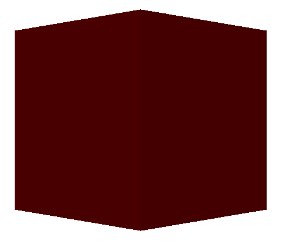

Creating A Collada Object
=========================

In this section, we outline how to create a collada document from scratch.
First, let's create an empy collada document::

    >>> from collada import *
    >>> mesh = Collada()
    
We could save this out, but it would be completely blank. Let's first add
a :class:`.Material` to the document::

    >>> mesh = Collada()
    >>> effect = material.Effect("effect0", [], "phong", diffuse=(1,0,0), specular=(0,1,0))
    >>> mat = material.Material("material0", "mymaterial", effect)
    >>> mesh.effects.append(effect)
    >>> mesh.materials.append(mat)

Note that the second argument to :class:`.Effect` is for parameters. These
are used for textures. We omit textures for simplicity here.

Next, let's first create some source arrays. These are going to be used to
create a triangle set later::

    >>> import numpy
    >>> vert_floats = [-50,50,50,50,50,50,-50,-50,50,50,
    ...     -50,50,-50,50,-50,50,50,-50,-50,-50,-50,50,-50,-50]
    >>> normal_floats = [0,0,1,0,0,1,0,0,1,0,0,1,0,1,0,
    ...     0,1,0,0,1,0,0,1,0,0,-1,0,0,-1,0,0,-1,0,0,-1,0,-1,0,0,
    ...     -1,0,0,-1,0,0,-1,0,0,1,0,0,1,0,0,1,0,0,1,0,0,0,0,-1,
    ...     0,0,-1,0,0,-1,0,0,-1]
    >>> vert_src = source.FloatSource("cubeverts-array", numpy.array(vert_floats), ('X', 'Y', 'Z'))
    >>> normal_src = source.FloatSource("cubenormals-array", numpy.array(normal_floats), ('X', 'Y', 'Z'))

Now that we have some sources, let's create a :class:`.Geometry` and add
the sources to it::

    >>> geom = geometry.Geometry(mesh, "geometry0", "mycube", [vert_src, normal_src])

To add a triangle set to the geometry, we can call the :meth:`.Geometry.createTriangleSet`
method. To do this, we need to define the inputs to the triangle set. In this case, we
are going to input the arrays we previously defined::
        
    >>> input_list = source.InputList()
    >>> input_list.addInput(0, 'VERTEX', "#cubeverts-array")
    >>> input_list.addInput(1, 'NORMAL', "#cubenormals-array")

This says to use the source with identifier `cubeverts-array` as the vertex source
and source with identifier `cubenormals-array` as the normal source. The offsets
indicate that the vertex data is the first offset in the index array and the normal
data is the second offset in the index array. Let's now create the index array::
    
    >>> indices = numpy.array([0,0,2,1,3,2,0,0,3,2,1,3,0,4,1,5,5,6,0,
    ...     4,5,6,4,7,6,8,7,9,3,10,6,8,3,10,2,11,0,12,
    ...     4,13,6,14,0,12,6,14,2,15,3,16,7,17,5,18,3,
    ...     16,5,18,1,19,5,20,7,21,6,22,5,20,6,22,4,23])

Now that we have an index array, an input list, and a material, we can create a
triangle set and add it to the geometry's list of primitives. We then add it to
the list of geometries in the mesh::

    >>> triset = geom.createTriangleSet(indices, input_list, "materialref")
    >>> geom.primitives.append(triset)
    >>> mesh.geometries.append(geom)

We now have everything we need in the object except for a scene. To get the geometry
to show up, we have to create a scene. First, we instantiate the geometry into a scene
node, mapping it to a material::

    >>> matnode = scene.MaterialNode("materialref", mat, inputs=[])
    >>> geomnode = scene.GeometryNode(geom, [matnode])
    >>> node = scene.Node("node0", children=[geomnode])

Now that we have the scene node, we can create a scene, add the node to the scene,
add the scene to the document, and then set our scene as the default::

    >>> myscene = scene.Scene("myscene", [node])
    >>> mesh.scenes.append(myscene)
    >>> mesh.scene = myscene

We can now save the document to a file::

    >>> mesh.write('/tmp/test.dae')
    
If you load this file, it should look like a red cube. Here's a screenshot:

